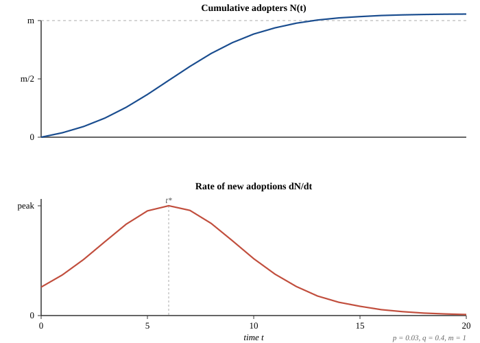

# The Diffusion of Cultural Artifacts

Most cultural products fail. A reasonable estimate places the fraction of new pop releases in any given year that achieve any meaningful chart penetration at well under one percent; the comparable figure for short-form video uploads, considered against the full corpus of what is uploaded, is several orders of magnitude smaller still. The interesting question is therefore not why most cultural artifacts disappear — that is the default outcome — but why a small minority achieve the kind of saturation that makes them, decades later, common cultural reference points.

This lesson develops three of the foundational frameworks for thinking about that question quantitatively: an affective account of why people share, a deterministic model of how adoption curves take shape over time, and a network-structural account of who actually drives cascades. None of these frameworks is sufficient on its own, but together they constitute the working vocabulary of contemporary diffusion research.

## 1. Affect and the Decision to Share

The most-cited contemporary work on what makes content travel is Berger and Milkman's 2012 study in the *Journal of Marketing Research*. Working with the complete set of articles published in *The New York Times* over a three-month period, the authors examined which articles ended up on the paper's "most-emailed" list and modeled the relationship between article characteristics and share probability.

Their headline finding overturned a common intuition. Sharing is not principally driven by valence — whether content is positive or negative — but by *arousal*. High-arousal positive emotions (awe, amusement) and high-arousal negative emotions (anger, anxiety) both predicted increased sharing. Low-arousal emotions, including sadness, predicted decreased sharing even when the content was otherwise comparable in surprise, interest, and practical utility. The result has been replicated across platforms and content types and has accumulated several thousand citations since publication; *Sage* recognized it with a 10-Year Impact Award in 2023.

The mechanism Berger and Milkman propose is physiological: arousal raises the probability that a recipient acts on a transmission impulse, and acting on the impulse — sending the link, forwarding the email, posting the clip — is the proximate cause of diffusion. The model is silent on the further question of why a recipient would *re-transmit* days or years later, and that question turns out to matter for our case study. But the affective filter explains a great deal of the variance in initial spread.

## 2. The Bass Diffusion Model

If Berger and Milkman explain the per-decision probability of sharing, the Bass diffusion model (Bass, 1969) explains the resulting population-level dynamics. Bass proposed that the rate at which new adopters acquire a product, a song, or any other diffusible artifact can be decomposed into two terms — adoption driven by independent decisions, and adoption driven by social contact with prior adopters. The model is written:

$$\frac{dN(t)}{dt} \;=\; \left(p \;+\; q\,\frac{N(t)}{m}\right)\bigl(m - N(t)\bigr)$$

where $N(t)$ is the cumulative number of adopters at time $t$, $m$ is the market potential (the eventual ceiling), $p$ is the *coefficient of innovation* (the rate at which still-unadopted people independently discover the artifact), and $q$ is the *coefficient of imitation* (the rate at which still-unadopted people adopt due to social exposure to the $N(t)/m$ fraction who already have).

Two features of this equation deserve emphasis. First, when $q > p$ — when imitation dominates innovation, which is the typical case for genuinely viral content — the resulting adoption curve is the familiar S-shape: slow start, accelerating middle, saturating tail. Second, the model has a closed-form solution and a closed-form expression for the time of peak adoption rate, which makes it tractable to fit against real chart or sales data. Bass himself fit it to eleven consumer durables — refrigerators, freezers, color televisions, room air conditioners, and so on — with strong agreement, and the model is now one of the most-cited empirical generalizations in marketing science, with over eleven thousand citations.

For our purposes the Bass model is a tool for asking a specific question: given the historical trajectory of a cultural artifact, can we recover plausible values of $p$, $q$, and $m$? If yes, the artifact's diffusion was, in some meaningful sense, ordinary — predictable in form even if surprising in magnitude. If no — if the empirical curve cannot be fit by any plausible parameter triple — then something is happening that the framework does not capture.

## 3. The Epidemiological Analogy

A different framework, drawn from epidemiology, gives a complementary picture. In compartmental models of disease — the SIR family, for Susceptible, Infected, Recovered — the central parameter is the *basic reproduction number* $R_0$:

$$R_0 \;=\; \frac{\beta}{\gamma}$$

where $\beta$ is the effective contact-and-transmission rate and $\gamma$ is the rate at which infected individuals leave the infectious compartment. $R_0$ is the expected number of secondary cases produced by one infectious individual in an otherwise fully susceptible population. When $R_0 > 1$, an outbreak grows; when $R_0 < 1$, it dies out.

Applied to cultural transmission, $\beta$ corresponds roughly to the rate at which a person who has encountered the artifact transmits it to a contact, and $\gamma$ to the rate at which an active sharer loses interest and stops transmitting. The analogy is loose — there is no strict equivalent of recovered immunity, since people can re-share content they have shared before — but the framing is useful because it makes precise the conditions under which a cultural artifact takes off rather than fizzling out, and because it forces us to think about $\beta$ and $\gamma$ separately rather than collapsing them into a single undifferentiated "virality."

## 4. Who Actually Drives Cascades

The popular account of viral spread holds that a small number of high-influence individuals — celebrities, tastemakers, "influentials" — disproportionately determine which artifacts succeed. Watts and Dodds (2007), simulating interpersonal-influence networks under a wide range of parameter choices, showed that this account is at best incomplete and at worst misleading. Across most parameter regimes the authors examined, large cascades were driven not by exceptional individuals seeding them but by a critical mass of *easily-influenced* recipients passing the artifact along once it reached them.

The practical implication is that the search for "who started it" is often the wrong search. The conditions for a cascade are network-structural — they concern the density and distribution of receptive nodes — more than they are biographical. We will return to this point in Module 2, where the artifact in question survives a twenty-year dormancy and re-emerges through a network whose receptive-node distribution looks nothing like the one it originally diffused through.

## 5. What the Frameworks Together Predict — and What They Don't

Taken together, Berger-Milkman, Bass, and Watts-Dodds give us a working account: high-arousal affect drives the per-recipient probability of sharing; the resulting diffusion follows an S-curve characterized by $(p, q, m)$; and the cascades that produce that curve are sustained less by who initiates them than by the receptive substrate they propagate through.

This account makes two assumptions worth flagging. First, it treats the artifact as a *fixed object* — what spreads in week 100 is what spread in week 1. Second, it treats $m$, the market potential, as bounded and stationary — a song has only so many possible listeners, and once the curve saturates, the story is over. Both assumptions are usually fine. They will both turn out to be wrong, in interesting ways, for the case we examine in Module 2.

The next lesson takes up a separate question: *given* that an artifact reaches a person, what determines whether it lodges? For that we need to leave diffusion modeling and turn to the cognitive science of musical memory.

---

## References

- Bass, F. M. (1969). A new product growth model for consumer durables. *Management Science*, 15(5), 215–227.
- Berger, J., & Milkman, K. L. (2012). What makes online content viral? *Journal of Marketing Research*, 49(2), 192–205.
- Watts, D. J., & Dodds, P. S. (2007). Influentials, networks, and public opinion formation. *Journal of Consumer Research*, 34(4), 441–458.
