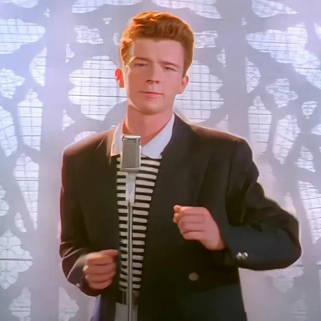

# The Boy and the Walk-Away

Module 2 closed with a question the framework cannot answer: what has any of this been like for the person whose face is on the video? The remaining two lessons leave the diffusion-modeling apparatus behind and turn instead to the man — the one who recorded the song on New Year's Day 1987, the one who walked away from the music industry six years later, the one who came back twenty years after that and conquered Glastonbury. This module is biographical rather than analytical. There is no equation in it. The argument it wants to make is harder to formalize: that the framework of Modules 1 and 2 has been describing the wrong object. The artifact is the song; the meme is the second-order phenomenon; but neither the artifact nor the meme is the *case*. The case is a person.

## 1. Newton-le-Willows

Richard Paul Astley was born on 6 February 1966 in Newton-le-Willows, then in Lancashire, now administratively part of Merseyside. He was the fourth child of Horace and Cynthia Astley. His parents divorced when he was five; he was raised by his father, with whom he has described his relationship in interviews as both affectionate and difficult. He has spoken about the household publicly, including in his 2024 memoir, titled, with characteristic dry literalism, *Never*. The relevant point for what follows is that he grew up serious. The two memories that recur in his interviews are the local church choir, where he started singing at ten, and his father's market-gardening business, where he worked from sixteen as a driver after leaving school.

## 2. The Drums and the Northern Circuit

Astley's first instrument was the drums. He played in a series of local bands through his late teens — Give Way, which performed Beatles and Shadows covers in pubs across the north-west of England, and FBI, a soul band that worked the Northern club circuit and won several local talent competitions. By 1985 he had moved from the drum kit to lead vocal in FBI after the band's singer left. The transition was not glamorous. It was a young man in a working soul band in Lancashire taking the microphone because someone else had quit.

The discovery came at a Warrington nightclub in 1985. The record producer Pete Waterman happened to be in the audience; he heard Astley sing; he invited him to London to work at the PWL studios in south London, which his Stock Aitken Waterman production team had recently established. Astley turned the offer down. Several months later, he changed his mind, accepted, and moved into a flat in Waterman's building.

What followed is one of the more curious career-grooming stories in late-twentieth-century pop music. Astley was hired not as a recording artist but as a *tape op* — a junior engineer running tape decks and fetching tea — and remained in that role for two years. The stated reason, given by both Astley and Waterman in subsequent interviews, was that Astley was extremely shy, and that the tape-op role was designed as a slow apprenticeship through which he would acclimate to the recording environment before being asked to perform in it. The role was, in his own phrase, "tea boy." It was also, in retrospect, an unusually patient on-ramp. By the time he sang on his first solo session — "Never Gonna Give You Up," recorded on New Year's Day 1987 — he had spent two years in the building.

## 3. The Career

The 1987–1989 stretch was, for Astley, what success looks like when it arrives compressed and total. Number one in twenty-five countries with the debut single. Number one in the UK and Australia with the debut album. Over fifteen million album copies sold worldwide. Best British Single at the 1988 BPI Awards. A 1989 Grammy nomination for Best New Artist (lost to Tracy Chapman). A second number-one US single with "Together Forever." A first world tour through fifteen countries.

It was also, by Astley's own account, the period in which he came to understand that he disliked the conditions of his own success. The British press had settled early on a "puppet" framing — Astley as a SAW-manufactured product rather than a musician with judgment of his own — and the framing stuck despite the fact that he had written five tracks on his second album. By the end of the 1989 world tour he wanted out. In 1991 he left Stock Aitken Waterman, recorded *Free* (with a guest appearance from Elton John on the single "Cry For Help," which reached the top ten in both the UK and the US), and turned away from dance-pop toward soul. *Body and Soul*, released in 1993, sold poorly. He was twenty-seven years old. His daughter Emilie had been born the year before. He had been in a relationship since 1989 with the Danish film producer Lene Bausager — whose own career would later include an Academy Award nomination, in 2006, for the short film *Cashback* — and whom he had first met in 1987 when she was working as a promoter at his record label. He retired from music.

## 4. The Walk-Away

The retirement is the part of this story that resists ordinary biographical handling, because the standard narrative for it — the burnout, the breakdown, the public meltdown — does not appear to apply. Astley's stated reason at the time, and his stated reason in every interview since, has been the same: he wanted to raise his daughter, and the working life of a touring pop musician is not compatible with raising a daughter. There is no contemporaneous evidence of a different and concealed reason. The retirement was not announced as a hiatus or a sabbatical. It lasted, in any meaningful career sense, the better part of a decade.

It is worth pausing on the simplicity of this. Twenty-seven-year-olds at the top of the UK and US charts do not, as a rule, walk away to be present for their toddlers. The cultural and economic incentives push very hard the other way. Astley walked. He spent the 1990s at home in Surrey with Lene and Emilie, doing occasional songwriting work — including a co-write on Marillion frontman Fish's 1999 solo album *Raingods with Zippos* — but no touring, no albums, no chart campaigns. He has said, looking back, that the working life of a 1980s pop star was "more like a travelling salesman than a musician or performer." The phrase is unflattering to the life he had been living. It is also, given the years he gave back to it, the kind of judgment a person earns the right to make.

In 2001 he came back, quietly, with the album *Keep It Turned On* and a single called "Sleeping," which became a minor club hit on the strength of a remix by the US house producer Todd Terry. In 2005 he released *Portrait*, an album of soul covers, which reached number 26 on the UK Albums Chart — his first chart appearance there since *Free* in 1991. By the early 2000s he was, in Module 1's framework, exactly what the Bass model in 1989 would have predicted: a former chart-topping artist living in pleasant obscurity, occasionally releasing material to a small remaining audience.

The next lesson takes up what happened next, which is the part of the story that the framework of Module 2 began to address — the meme, the second wave, the recoupling — but treated as a phenomenon rather than as something happening to a person.

---

## References

- Astley, R. (2024). *Never: The Autobiography*. Faber.
- Wikipedia, "Rick Astley" (consulted for chronology and primary-source references).
- Stock, M. (2022). Interview on "Never Gonna Give You Up." *Song Exploder*, episode 220.
