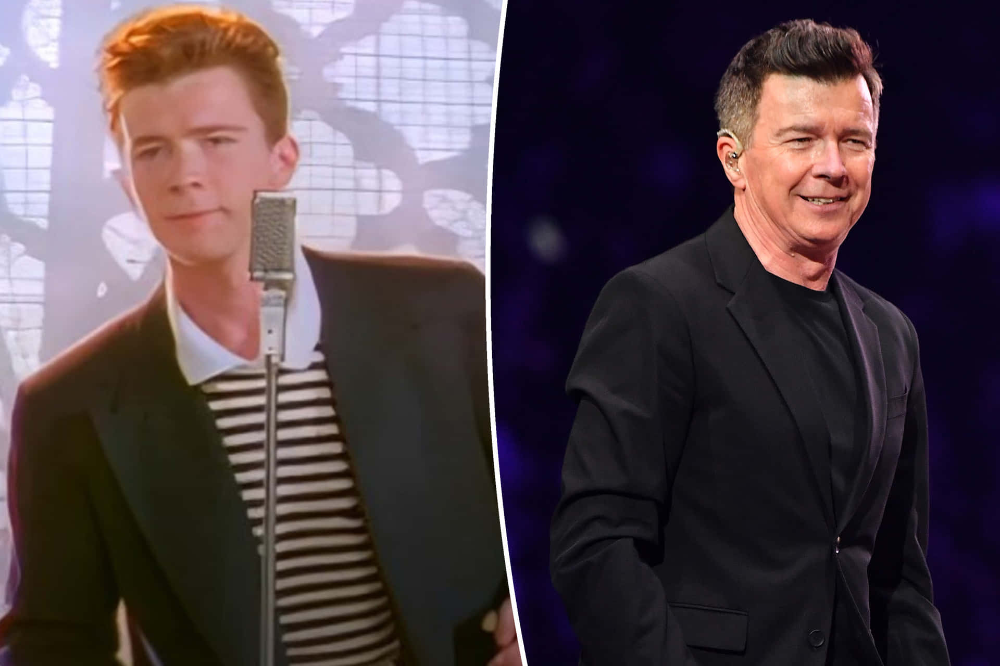

# A Memetic Distortion Field

The previous lesson left Astley in 2005 — out of the spotlight, periodically releasing modest soul records, raising his daughter in Surrey, in a long relationship with Lene Bausager whose film production company was about to receive an Academy Award nomination for the 2006 short film *Cashback*. He was thirty-nine. He had been retired-then-quietly-active for twelve years. By any reasonable extrapolation from the available data, this was the trajectory. The next ten years made a different shape entirely.

## 1. The Meme Arrives Without Him

The first thing to note about the second wave from Astley's point of view is that it happened to him rather than because of him. He had no involvement in the 4chan duckroll convention, the May 2007 *Grand Theft Auto IV* trick, or any of the chronology described in Lesson 2.2. He found out he was being rickrolled the way everyone else found out — by being rickrolled, in his case via an email chain from a friend in the United States.

His initial reaction is a small but characteristic detail. Asked about it in 2008, he described the phenomenon as bizarre and said his main concern was that his teenage daughter would be embarrassed. There is no evidence he sought to monetize the meme during its peak years — the song's 2008 sales spike yielded famously small per-stream royalties, on the order of low double-digit dollars in his case — and his on-screen participation was limited to a handful of opportunities he found amusing rather than strategic. He agreed to the Macy's Parade appearance because it sounded funny. He let the MTV Europe Music Awards Best Act Ever vote-mob run its course. When asked to explain why he stayed largely uninvolved, he has tended to give the same answer: the meme belonged to the internet. He was the inadvertent host.

## 2. The Genuine Return

The professional reactivation is a separate phenomenon from the meme, and the two are worth keeping distinct. Astley released *50* in June 2016 — the title is his age — written and produced largely by himself in a home studio. The album reached number one on the UK Albums Chart for the week of 17 to 23 June 2016, his first UK number-one album in twenty-nine years. It sold over four hundred thousand copies in the UK and was certified Platinum the following year. None of this was meme-driven in the proximate sense. *50* charted because Astley had spent seven years writing songs in a shed and had at last produced a record his now-grown audience wanted to buy.

What followed was a coherent late-career arc. *Beautiful Life* in 2018. A 2019 supporting tour with Take That to combined audiences exceeding five hundred thousand. *The Best of Me* later in 2019. *Are We There Yet?* in 2023, debuting at number two on the UK Albums Chart. The autobiography, *Never*, in October 2024. Several sold-out arena dates. A late-career income that, by 2023, had restored him to financial-and-cultural relevance independent of the meme.

The meme remained in the background as a kind of long-running gift. The official YouTube upload of "Never Gonna Give You Up" passed one billion views in July 2021, the fourth song from the 1980s to do so. A 2021 cameo in the *Ted Lasso* episode "No Weddings and a Funeral" — the song reframed as a sincere expression of grief, sung in a chapel rather than deployed as a bait-and-switch — was widely cited as the moment at which a generation of younger viewers heard the lyrics in earnest for the first time. The "Never Gonna" emote in *Fortnite*, in which a player's avatar performs a loop of Astley's signature gestures from the 1987 video, brought him to a still-younger audience that knew the dance before knowing the song.

## 3. Glastonbury

In June 2023, at the age of fifty-seven, Astley played the Pyramid Stage at Glastonbury for the first time. The slot was Saturday lunchtime, traditionally a difficult position — the audience is hungover, the headliners are still hours away, the legend slot proper is held later in the day. He played a set built mostly around the *50* material rather than the 1987 catalogue, with a cover of Harry Styles's "As It Was," an AC/DC cover during which he played drums, and "Never Gonna Give You Up" as the closer. *The Guardian* gave the performance five stars. Dermot O'Leary, presenting the BBC coverage, said Astley had stolen Glastonbury. Later that afternoon Astley returned to a smaller stage to perform a second, separate set with the indie band Blossoms — covers of The Smiths, sung straight, with no irony — that several reviewers nominated as the festival's most surprising performance.

The Smiths covers are worth a moment. Morrissey's lyrics are a precise emotional inverse of Astley's: where the 1987 chorus promises constancy, the Smiths catalogue specializes in elegant despair. Astley sang them the way he sings everything — earnestly, fully, on the pitch he wrote in 1987. *The Guardian's* review observed that this was its own form of Rickroll: the audience expected a knowing 1980s nostalgia performance and got, instead, the actual feeling.

## 4. The Lyrics Read Straight

It is worth reading the chorus once more, in light of all of this. The chorus of "Never Gonna Give You Up" — that the 1987 listener heard as a danceable promise, that the 2007 victim heard as the soundtrack to a small online deception, that Lesson 1.2 paraphrased as monosyllabic promises clustered around commitment, fidelity, and refusal-to-deceive — describes someone who will not give the addressee up, will not let them down, will not run around or desert them, will not make them cry, will not say goodbye, will not tell a lie or hurt them.

Mike Stock and Matt Aitken wrote those lines. Astley delivered them at twenty-one as a session vocalist on his first solo recording.

The internet, twenty years later, made the song into the world's most famous joke about deception. The man on the cover, in roughly the same period, raised his daughter, stayed with his partner, declined the parts of fame he disliked, walked away when he wanted to, came back when he wanted to, and — at sixty, a year after Glastonbury — is still married to the woman he met when he was twenty-one.

The joke and the truth, as it happens, are the same sentence read in two registers.

---

## References

- Astley, R. (2024). *Never: The Autobiography*. Faber.
- *The Guardian* (June 2023). Glastonbury 2023 reviews and coverage.
- BBC News (2018). "Rick Astley on his wife Lene: 'The success I'm having is due to her.'"
- Wikipedia, "Rick Astley" and "Rick Astley discography" (consulted for chronology and chart history).

(Citations from earlier modules also apply throughout.)
